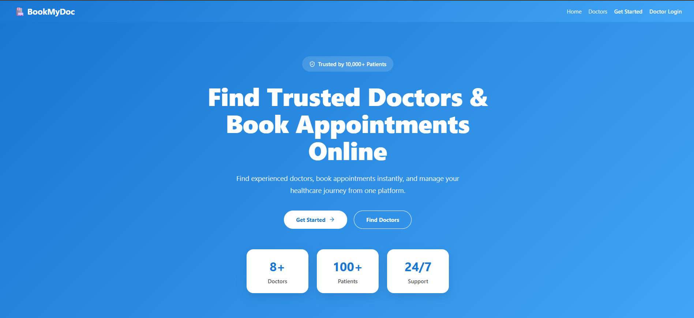
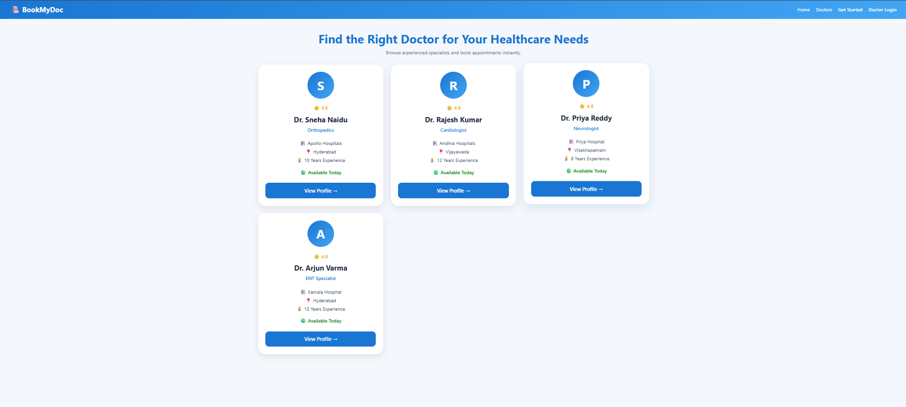

# 🏥 BookMyDoc

<div align="center">

### Healthcare Appointment Booking Platform

**React.js • Spring Boot • Microservices • API Gateway • Eureka • MySQL**

A modern healthcare appointment booking platform that allows patients to find doctors, book appointments, and track appointment status while enabling doctors to manage availability and appointment requests.


⭐ If you found this project useful, consider giving it a star.

</div>

---

# 🚀 Features

## 👤 Patient Features

* User Registration & Login
* Browse Doctors
* View Doctor Profiles
* Book Appointments
* Select Available Slots
* View Appointment Status
* Cancel Appointments
* Personalized Dashboard

## 👨‍⚕️ Doctor Features

* Doctor Login
* Doctor Dashboard
* Manage Availability
* Create Time Slots
* View Appointment Requests
* Approve Appointments
* Reject Appointments
* View Previous Slots

## ⚙️ System Features

* REST APIs
* Spring Boot Microservices
* API Gateway
* Eureka Service Discovery
* MySQL Database
* Responsive User Interface

---

# 🏗️ Microservices Architecture

```text
                   React Frontend
                          │
                          ▼
                    API Gateway
                          │
         ┌────────────────┼────────────────┐
         ▼                ▼                ▼

    User Service    Doctor Service   Appointment Service

         │                │                │
         └────────────────┴────────────────┘
                          │
                          ▼
                        MySQL
```

---

# 🛠️ Tech Stack

### Frontend

* React.js
* JavaScript
* CSS3
* React Router
* Vite

### Backend

* Java
* Spring Boot
* Spring Data JPA
* REST APIs

### Microservices

* Eureka Service Registry
* API Gateway

### Database

* MySQL

### Tools

* Maven
* Git
* GitHub
* Thunder Client
* VS Code
* Eclipse

---

# 📸 Application ScreenShots

## 🏠 Landing Page



---

## 👨‍⚕️ Doctors Page



---

## 🩺 Doctor Profile Page


---

## 📅 Book Appointment Page


---

## 👤 User Dashboard


---

## 📋 User Appointments


---

## 👨‍⚕️ Doctor Dashboard


---

## 📝 Doctor Appointments


---

## ⏰ Doctor Availability


---

# ⚡ Installation

## Clone Repository

```bash
git clone https://github.com/Madhan21-ui/BookMyDoc.git
```

## Frontend Setup

```bash
cd bookmydoc-ui

npm install

npm run dev
```

## Backend Setup

Start services in the following order:

```text
1. Service Registry
2. API Gateway
3. User Service
4. Doctor Service
5. Appointment Service
```

Run each service:

```bash
mvn spring-boot:run
```

---

# 📌 API Endpoints

## User Service

```http
POST /users/register
POST /users/login
GET /users/email/{email}
```

## Doctor Service

```http
POST /doctors/register
POST /doctors/login
GET /doctors
GET /doctors/{id}
```

## Availability Service

```http
POST /availability
GET /availability
GET /availability/doctor/{doctorId}
GET /availability/doctor/{doctorId}/{date}
DELETE /availability/{id}
PUT /availability/book-slot
```

## Appointment Service

```http
POST /appointments
GET /appointments/user/{email}
GET /appointments/doctor/{doctorId}
PUT /appointments/{id}/approve
PUT /appointments/{id}/reject
```

---

# 🎯 Key Learning Outcomes

Through this project, I gained hands-on experience in:

* Spring Boot Microservices
* API Gateway Routing
* Eureka Service Discovery
* REST API Development
* Frontend & Backend Integration
* MySQL Database Management
* Real-world Healthcare Workflow Design
* Full Stack Application Development

---

# 🌟 Future Enhancements

* Video Consultation
* Online Payments
* Doctor Ratings & Reviews
* Email Notifications
* SMS Notifications
* Prescription Management
* Admin Dashboard
* AI-Based Doctor Recommendation System

---

# 👨‍💻 Developer

## Madhan Nagireddy

**Java Full Stack Developer | Spring Boot | Microservices | React.js | REST APIs | MySQL**

### Connect With Me

🔗 LinkedIn

https://www.linkedin.com/in/madhan-nagireddy-/

🔗 GitHub

https://github.com/Madhan21-ui

🔗 Portfolio

https://madhan21-ui.github.io/MadhanNagireddy_portfolio/

---

<div align="center">

### ⭐ Thank You For Visiting This Repository ⭐

If you like this project, please consider starring the repository.

</div>
